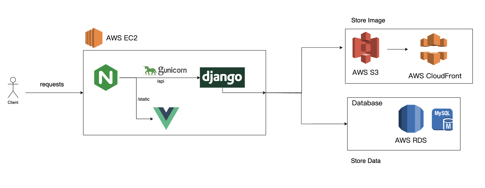
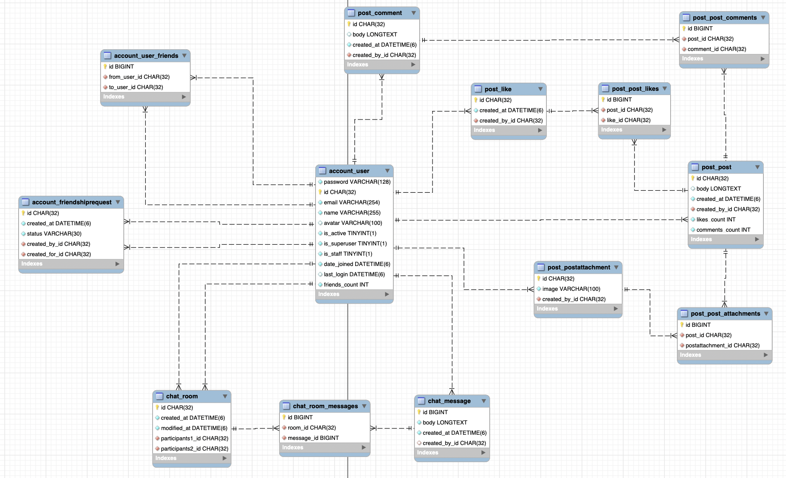

# Repli-Insta

## Introduction

"Repli Insta" is a social website that provides posting, commenting, likes, and real-time chat.

Website: https://planabcd.site/


https://github.com/CSY-Betty/Repli2/assets/84286529/fb84aefe-3e43-4b79-9f55-f702e79e14b2

https://github.com/CSY-Betty/Repli_Insta/assets/84286529/03c24c79-4744-4f39-a54e-d88ca459185c


## Technique

### Frontend

-   Vue.js

### Backend

-   Django

    -   Django REST framework
    -   Channels

-   AWS

    -   EC2
    -   RDS MySQL
    -   S3
    -   CloudFront

-   Nginx
-   Gunicorn

## Structure

### Data Flow Diagram



### ER diagram



## Setting

### .env File

Create a .env file in the repli_backend directory and add the following configurations:

```
# RDS
RDSuser=
RDSpassword=
HOST=

# S3
AWS_ACCESS_KEY_ID=
AWS_SECRET_ACCESS_KEY=
AWS_STORAGE_BUCKET_NAME=
AWS_S3_REGION_NAME=
AWS_S3_CUSTOM_DOMAIN=
```

### Dependencies

```shell
pip install -r requirements.txt
pip install gunicorn
pip install 'uvicorn[standard]'
```

### Configuration Files

In server_files directory, are four configuration Files ,below

#### Nginx Configuration Files

nginx_apirepli.conf: This file contains the configuration settings for api django. It is typically located in /etc/nginx/sites-enabled/.
nginx_repli.conf: This file contains the configuration settings for static file. It is also located in /etc/nginx/sites-enabled/.

#### Gunicorn Configuration File

gunicorn_start.conf: This file contains configuration settings for Gunicorn, the ASGI HTTP server for Python web applications, specifically for the application itself. It is located in /repli/venv/bin/.
daphne_start.conf: This file contains configuration settings for Daphne, which is an ASGI server typically used for WebSocket connections. It is located in /repli/venv/bin/.

#### Supervisor Configuration File

supervisor_repli.conf: This file contains configuration settings for Supervisor, a process control system for Unix-like operating systems. It manages the configuration of the entire application deployment. It is located in /etc/supervisor/conf.d/.
repli_daphne.conf: This file manages the configuration related to Daphne's operation within the Supervisor system. It is located in /etc/supervisor/conf.d/.
